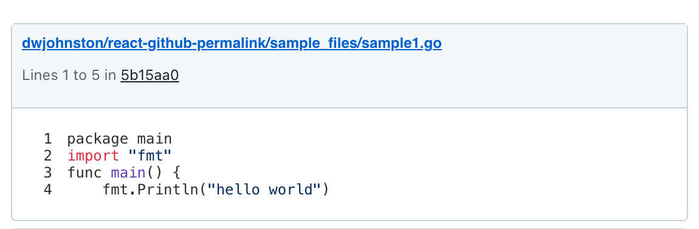
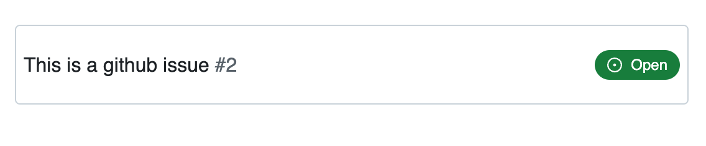

# React Github Permalink

_Now with issue links!_ 

## Github Permalink

Given a Github permalink, show the code block. 




### Usage
```jsx
import { GithubPermalink } from 'react-github-permalink';
import "react-github-permalink/dist/github-permalink.css"; // Or provide your own styles

export function MyApp() {
    return  <GithubPermalink permalink="https://github.com/dwjohnston/react-github-permalink/blob/5b15aa07e60af4e317086f391b28cadf9aae8e1b/sample_files/sample1.go#L1-L5"/>
}
```

I also highly rate the [`vscode-copy-github-permalink` plugin](https://marketplace.visualstudio.com/items?itemName=hogashi.vscode-copy-github-permalink) which makes for ease in generating the permalinks from within VSCode.

## Github Issuelink




### Usage
```jsx
import { GithubPermalink } from 'react-github-permalink';
import "react-github-permalink/dist/github-permalink.css"; // Or provide your own styles

export function MyApp() {
    return  <GithubIssueLink issueLink='https://github.com/dwjohnston/react-github-permalink/issues/2' />,
}
```


## Demo

https://codesandbox.io/s/exciting-nova-js5zlk?file=/src/App.js

## Rate Limits and Authentication

This component makes unauthenticated requests against Github's API. The rate limit for such requests is 60/hour and only publicly visible repositories are available. 

If you need to avoid rate limits or allow users to view private repos, you can implement your own data fetching function. 

## Configuration 

You can provide your own data fetching function via a context provider. 

### Custom Data Function

```jsx
import { GithubPermalink, GithubPermalinkContext } from 'react-github-permalink';
import "react-github-permalink/dist/github-permalink.css";

export function MyApp() {
    return <GithubPermalinkProvider getDataFn ={(permalink: string) => {
            // Your implementation to retrieve permalinks here 
        }}
        getIssueFn={(issueLink: string) => {
            // Your implementation to retrieve issue links here
        }}

    
    >  
        <GithubPermalink permalink="https://github.com/dwjohnston/react-github-permalink/blob/5b15aa07e60af4e317086f391b28cadf9aae8e1b/sample_files/sample1.go#L1-L5"/>
    </GithubPermalinkProvider>
}    
```

### Using a github token 

In development you may find yourself hitting the API rate limit rather quickly, and this can be pain. 

You can provide a Github token to avoid this. 

**Do not use your private tokens in production, they will be public for the world to see!**

```jsx
import { GithubPermalink, GithubPermalinkContext } from 'react-github-permalink';
import "react-github-permalink/dist/github-permalink.css";

export function MyApp() {
    return <GithubPermalinkProvider githubToken={process.env.NODE_ENV='development' && process.env.MY_GITHUB_TOKEN}>  
        <GithubPermalink permalink="https://github.com/dwjohnston/react-github-permalink/blob/5b15aa07e60af4e317086f391b28cadf9aae8e1b/sample_files/sample1.go#L1-L5"/>
    </GithubPermalinkProvider>
}    

```