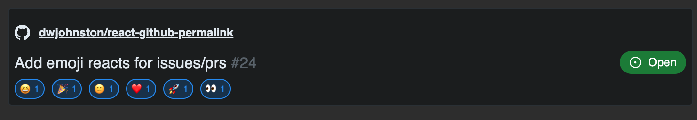

# React Github Permalink

Display Github permalinks as codeblocks. 

Display Github issue links. 

Display Stack Overflow question links. 





I highly rate the [`vscode-copy-github-permalink` plugin](https://marketplace.visualstudio.com/items?itemName=hogashi.vscode-copy-github-permalink) for ease in generating the permalinks from within VSCode.

## Demo

https://codesandbox.io/s/exciting-nova-js5zlk?file=/src/App.js


## RSC Compatibility / Three modes of operation

This package is compatible with Next 13+ and the components can be used as RSCs if you wish. 

Three variants of each component are exported

 - GithubPermalink/GithubIssueLink/StackOverflowLink - Client component - It fetches the data as on the client in a useEffect. ie. Data won't be retrieved until application has loaded in user's browser.   
 - GithubPermalinkBase/GithubIssueLinkBase/StackOverflowLinkBase - this is the base component - it does no data fetching on its own. 
 - GithubPermalinkRsc/GithubIssueLinkRsc/StackOverflowLinkRsc - This is an RSC. 


### Basic usage (Client component) 
```jsx
import { GithubPermalink } from 'react-github-permalink';
import "react-github-permalink/dist/github-permalink.css"; // Or provide your own styles

export function MyApp() {
    return  <GithubPermalink permalink="https://github.com/dwjohnston/react-github-permalink/blob/5b15aa07e60af4e317086f391b28cadf9aae8e1b/sample_files/sample1.go#L1-L5"/>
}
```


### Provide your own data

```jsx
import { GithubPermalinkBase } from 'react-github-permalink';
import "react-github-permalink/dist/github-permalink.css"; // Or provide your own styles

export function MyApp() {
    return          <GithubPermalinkBase
            permalink="https://github.com/dwjohnston/react-github-permalink/blob/5b15aa07e60af4e317086f391b28cadf9aae8e1b/sample_files/sample1.go#L1-L5"
            data={{
                lines: [
                    "package main",
                    "import \"fmt\"",
                    "func main() {",
                    "    fmt.Println(\"hello world\")",
                    "}"
                ],
                lineFrom: 1,
                lineTo: 5,
                commit: "5b15aa07e60af4e317086f391b28cadf9aae8e1b",
                path: "sample_files/sample1.go",
                owner: "dwjohnston",
                repo: "react-github-permalink",
                commitUrl: "https://github.com/dwjohnston/react-github-permalink/commit/5b15aa07e60af4e317086f391b28cadf9aae8e1b",
                status: "ok"
            }} />
}
```

You may wish you use this approach if my approach for configuration does not work for you 

### RSC


```jsx
import { GithubPermalinkRsc } from 'react-github-permalink/dist/rsc';
import "react-github-permalink/dist/github-permalink.css"; // Or provide your own styles

export function MyApp() {
    return  <GithubPermalinkRsc permalink="https://github.com/dwjohnston/react-github-permalink/blob/5b15aa07e60af4e317086f391b28cadf9aae8e1b/sample_files/sample1.go#L1-L5"/>
}
```

Note that import path is different. 


## Github Issuelink

### Usage
```jsx
import { GithubPermalink } from 'react-github-permalink';
import "react-github-permalink/dist/github-permalink.css"; // Or provide your own styles

export function MyApp() {
    return  <GithubIssueLink issueLink='https://github.com/dwjohnston/react-github-permalink/issues/2' />,
}
```


IssueLink also has an inline variant: 

```jsx
export function MyApp() {
    return  <GithubIssueLink issueLink='https://github.com/dwjohnston/react-github-permalink/issues/2' variant="inline"/>,
}
```

## Stack Overflow Links

### Usage
```jsx
import { StackOverflowLink } from 'react-github-permalink';
import "react-github-permalink/dist/github-permalink.css"; // Or provide your own styles

export function MyApp() {
    return  <StackOverflowLink questionLink='https://stackoverflow.com/questions/64572466/how-to-use-react-context-in-typescript' />
}
```

StackOverflowLink also has an inline variant: 

```jsx
export function MyApp() {
    return  <StackOverflowLink questionLink='https://stackoverflow.com/questions/64572466/how-to-use-react-context-in-typescript' variant="inline"/>
}
```

## Rate Limits and Authentication

By default the components make unauthenticated requests against Github's API. The rate limit for such requests is 60/hour and only publicly visible repositories are available. 

If you need to avoid rate limits or allow users to view private repos, you can implement your own data fetching function. 

## Configuration 

The global configuration object has this signature

```ts
type BaseConfiguration = {
    getDataFn: (permalink: string, githubToken?: string | undefined, onError?: ((err: unknown) => void) | undefined) => Promise<GithubPermalinkDataResponse>;
    getIssueFn: (issueLink: string, githubToken?: string | undefined, onError?: ((err: unknown) => void) | undefined) => Promise<GithubIssueLinkDataResponse>;
    getStackOverflowFn: (questionLink: string, onError?: ((err: unknown) => void) | undefined) => Promise<StackOverflowLinkDataResponse>;
    githubToken: string | undefined;
    onError: ((e: unknown) => void) | undefined;
}
```

### Configure client components via GithubPermalinkProvider

Client components are configured via context provider: 

```tsx
import { GithubPermalink, GithubIssueLink GithubPermalinkProvider,  } from 'react-github-permalink';
import "react-github-permalink/dist/github-permalink.css";

export function MyApp() {
    return <GithubPermalinkProvider 
        getDataFn ={(permalink: string) => {
            // Your implementation to retrieve permalinks here 
        }}
        getIssueFn={(issueLink: string) => {
            // Your implementation to retrieve issue links here
        }}

        // Don't put a put a github token into the context provider in production! It will visible for all the world to see!
        // Instead you will need to expose a data fetching function on the backend to do it for you 
        githubToken={process.env.NODE_ENV='development' && process.env.MY_GITHUB_TOKEN}

        onError={(err) => {
            Sentry.captureException(err);
        }}
    >  
        <GithubPermalink permalink="https://github.com/dwjohnston/react-github-permalink/blob/5b15aa07e60af4e317086f391b28cadf9aae8e1b/sample_files/sample1.go#L1-L5"/>
        <GithubIssueLink issueLink='https://github.com/dwjohnston/react-github-permalink/issues/2' />
    </GithubPermalinkProvider>
}    
```

### Configure RSC components via githubPermalinkRscConfig singleton

In a Next.js 13+ app using the app router, I recommend configuring the `githubPermalinkRscConfig` object in your route level `layout.tsx` file. 

```tsx

import "react-github-permalink/dist/github-permalink.css";
import {githubPermalinkRscConfig} from "react-github-permalink/dist/rsc";
githubPermalinkRscConfig.setConfig({
  githubToken: process.env.GITHUB_TOKEN
})

export default function RootLayout({
  children,
}: Readonly<{
  children: React.ReactNode;
}>) {
   // your layout component here 
}
```
